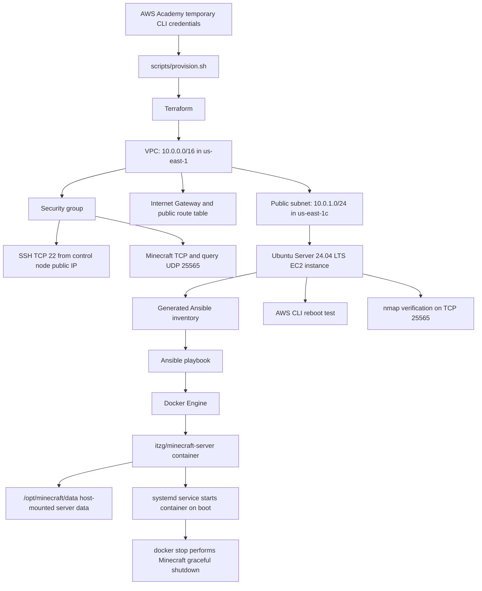

# Course Project Part 2: Automated Minecraft Server Deployment on AWS

Ryan O'Rourke  
CS312_400_S2026  
Professor Virasak

## Background

In Course Project Part 1, I deployed a Minecraft Java server manually on an Ubuntu EC2 instance. This repository automates a new deployment of that service. Terraform provisions the AWS networking and EC2 resources. Ansible installs Docker and deploys a Minecraft Java server container. The Minecraft server is then tested externally with `nmap` and tested again after an AWS CLI reboot operation.

The deployment is performed from a local Ubuntu or WSL control node. The AWS Management Console is not used to provision or configure the server, and the configuration process does not require an interactive SSH session with the EC2 instance.

## Pipeline Diagram



## Repository Layout

```text
.
├── .gitignore
├── README.md
├── ansible
│   ├── ansible.cfg
│   ├── files
│   │   ├── minecraft-container.service
│   │   └── minecraft.env
│   └── minecraft.yml
├── scripts
│   ├── configure.sh
│   ├── provision.sh
│   ├── reboot-test.sh
│   └── verify.sh
└── terraform
    ├── main.tf
    ├── outputs.tf
    ├── variables.tf
    └── versions.tf
```

The deployment generates files that are not stored in Git:

- `.runtime/terraform.tfvars` stores the current control-node public IPv4 CIDR and the local EC2 public key path required by Terraform.
- `.runtime/deployment.env` stores Terraform outputs needed by the verification scripts.
- `.runtime/known_hosts` stores the provisioned EC2 host key used by automated Ansible connections.
- `ansible/hosts.ini` is generated from the public IP address returned by Terraform.
- Terraform state files represent the live AWS deployment and are excluded from the repository.

## Requirements

### Local Control Node

The pipeline is designed to run from Ubuntu Linux or Ubuntu under WSL. The control node must have the following installed:

| Tool | Required version or package | Purpose |
| --- | --- | --- |
| AWS CLI | Version 2 | Authenticates with AWS Academy temporary credentials and performs the reboot test |
| Terraform | `>= 1.6.0` | Provisions AWS infrastructure |
| Ansible | `>= 2.14` | Configures the EC2 instance and Minecraft container service |
| Git | Ubuntu package | Retrieves and versions this repository |
| OpenSSH client | Ubuntu package | Supplies the automated Ansible management connection |
| `curl` | Ubuntu package | Retrieves the control-node public IPv4 address for the SSH security-group rule |
| `nmap` | Ubuntu package | Verifies the public Minecraft service |

Install Ubuntu-packaged requirements:

```bash
sudo apt update
sudo apt install -y ansible curl git nmap openssh-client unzip gpg
```

Install AWS CLI version 2:

```bash
cd /tmp
curl --fail --silent --show-error --location "https://awscli.amazonaws.com/awscli-exe-linux-x86_64.zip" --output awscliv2.zip
rm -rf aws
unzip -q -o awscliv2.zip
sudo ./aws/install --update
```

Install Terraform from HashiCorp's Ubuntu package repository:

```bash
curl --fail --silent --show-error --location https://apt.releases.hashicorp.com/gpg | gpg --dearmor | sudo tee /usr/share/keyrings/hashicorp-archive-keyring.gpg >/dev/null
echo "deb [signed-by=/usr/share/keyrings/hashicorp-archive-keyring.gpg] https://apt.releases.hashicorp.com $(. /etc/os-release && echo "${UBUNTU_CODENAME:-$VERSION_CODENAME}") main" | sudo tee /etc/apt/sources.list.d/hashicorp.list >/dev/null
sudo apt update
sudo apt install -y terraform
```

Verify the tools:

```bash
aws --version
terraform version
ansible --version
nmap --version
```

### AWS Academy Credentials and Deployment Location

This deployment uses the AWS Academy Learner Lab temporary CLI credentials and creates resources in the following location:

```text
AWS Region: us-east-1
Availability Zone: us-east-1c
```

Start the Learner Lab, copy the current AWS CLI credential block into `~/.aws/credentials`, and configure the default region and output format:

```bash
mkdir -p ~/.aws
chmod 700 ~/.aws
vim ~/.aws/credentials
aws configure set region us-east-1
aws configure set output json
aws sts get-caller-identity
```

AWS Academy credentials expire. Retrieve a current credential block before deploying, reboot-testing, or destroying the resources when the previous credentials are no longer valid.

### Minecraft EULA

The container configuration includes `EULA=TRUE`, which is required for the Minecraft server to start. Review the [Minecraft End User License Agreement](https://www.minecraft.net/eula) before running the configuration script.

## Infrastructure Provisioned by Terraform

Terraform creates the following AWS resources in `us-east-1` without loading a configuration script through EC2 user data:

| Resource | Configuration |
| --- | --- |
| VPC | `10.0.0.0/16` |
| Public subnet | `10.0.1.0/24` in `us-east-1c` with public IPv4 assignment enabled |
| Internet Gateway | Attached to the project VPC |
| Public route table | Routes `0.0.0.0/0` to the Internet Gateway and is associated with the public subnet |
| Security group | TCP `22` from the current control-node IPv4 address only; TCP `25565` and UDP `25565` from the Internet |
| EC2 key pair | Registers the public key automatically created by `scripts/provision.sh` |
| EC2 instance | Ubuntu Server 24.04 LTS, `t2.micro`, encrypted 12 GiB `gp3` root volume |

## Server Configuration Performed by Ansible

Ansible configures the provisioned EC2 instance through an automated inventory-based connection. It performs the following tasks:

1. Installs the Ubuntu `docker.io` package and enables the Docker service at boot.
2. Creates `/opt/minecraft/data` as the persistent host-mounted Minecraft data directory.
3. Copies the container environment configuration into `/etc/minecraft/minecraft.env`.
4. Pulls the `itzg/minecraft-server:latest` Docker image.
5. Installs and enables `minecraft-container.service`.
6. Starts a vanilla Minecraft Java server container on port `25565`.
7. Enables the query protocol on UDP port `25565` and exposes TCP port `25565` for client and `nmap` verification traffic.
8. Runs the playbook a second time to demonstrate idempotent configuration behavior.

The container maps `/opt/minecraft/data` on the EC2 host to `/data` inside the container. Minecraft world and configuration files therefore remain on the EC2 instance when the container is replaced or restarted.

## Startup and Proper Shutdown Behavior

The `minecraft-container.service` unit is enabled through `systemd`, so the container starts after the EC2 instance boots. The unit stops the server with:

```bash
/usr/bin/docker stop --timeout 90 minecraft-server
```

The selected Minecraft Docker image enables RCON for coordinated saving and uses a Docker stop request to perform a graceful Minecraft server stop. The RCON port is not published through Docker or opened in the AWS security group.

## Commands to Run

### 1. Clone the Repository

```bash
git clone https://github.com/facesnorth/cs312-course-project-2.git
cd cs312-course-project-2
chmod +x scripts/*.sh
```

### 2. Provision the AWS Infrastructure

```bash
./scripts/provision.sh
```

This script validates AWS CLI access, generates a project-specific EC2 SSH key if it does not already exist, limits SSH access to the current public IPv4 address of the control node, runs Terraform, writes the generated Ansible inventory, and records the new EC2 host key for automated configuration.

After the first Terraform initialization, commit the generated provider dependency lock file:

```bash
git add terraform/.terraform.lock.hcl
git commit -m "Record Terraform AWS provider lock file"
git push origin main
```

### 3. Configure the Minecraft Server

```bash
./scripts/configure.sh
```

This script waits for Ansible connectivity, runs the Minecraft playbook, and immediately runs it a second time. The second playbook recap should report `changed=0` because the desired Docker and Minecraft service configuration is already present.

### 4. Verify the Running Server

```bash
./scripts/verify.sh
```

This script shows the enabled and active `systemd` service, the running Minecraft Docker container, the generated Minecraft port and query configuration, the installed service start/stop commands, and the required external `nmap` result.

The public validation command executed by the script is:

```bash
source .runtime/deployment.env
nmap -sV -Pn -p T:25565 "$PUBLIC_IP"
```

A successful verification reports TCP port `25565` as `open`.

### 5. Verify Controlled Shutdown and Automatic Restart After Reboot

```bash
./scripts/reboot-test.sh
```

This script first stops the Minecraft service through `systemd` and displays the container shutdown log output. It starts the service again, reboots the EC2 instance through the AWS CLI, waits for automated Ansible connectivity to return, and reruns the external `nmap` verification.

## Connecting to the Minecraft Server

The deployed public Minecraft server address is printed by Terraform at the end of `scripts/provision.sh` as `minecraft_server_address`. A compatible Minecraft Java Edition client can use that address directly.

The project verification method uses the approved `nmap` connection test rather than requiring a local Minecraft client:

```bash
./scripts/verify.sh
```

## Resource Removal

After the deployment no longer needs to remain available, remove the Terraform-managed AWS resources from the repository root:

```bash
terraform -chdir=terraform destroy -auto-approve -var-file="../.runtime/terraform.tfvars"
rm -rf .runtime ansible/hosts.ini
```

## Resources and Sources Used

- [Minecraft: Java Edition Server Download](https://www.minecraft.net/en-us/download/server)
- [Minecraft End User License Agreement](https://www.minecraft.net/eula)
- [Minecraft Server on Docker: Intro](https://docker-minecraft-server.readthedocs.io/en/latest/)
- [Minecraft Server on Docker: Server Properties, RCON, and Query](https://docker-minecraft-server.readthedocs.io/en/latest/configuration/server-properties/)
- [AWS CLI Version 2 Installation](https://docs.aws.amazon.com/cli/latest/userguide/getting-started-install.html)
- [AWS EC2 Documentation](https://docs.aws.amazon.com/ec2/)
- [Terraform AWS Provider Documentation](https://registry.terraform.io/providers/hashicorp/aws/latest/docs)
- [Terraform Installation Documentation](https://developer.hashicorp.com/terraform/install)
- [Ansible Builtin Collection Documentation](https://docs.ansible.com/ansible/latest/collections/ansible/builtin/)
- [Docker Engine Documentation](https://docs.docker.com/engine/)
- [systemd Service Unit Documentation](https://www.freedesktop.org/software/systemd/man/latest/systemd.service.html)
- [Nmap Reference Guide](https://nmap.org/book/man.html)
